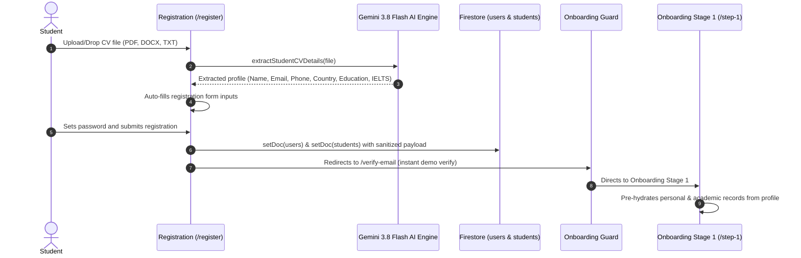
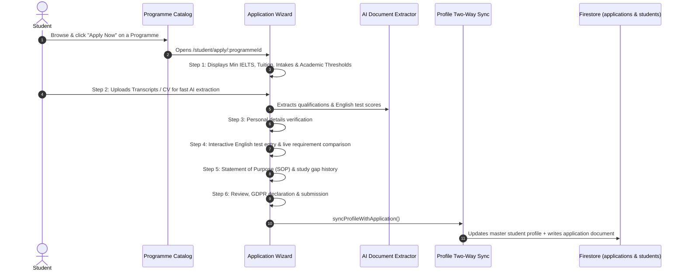
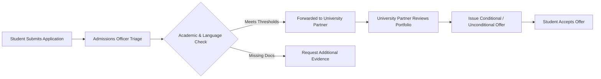
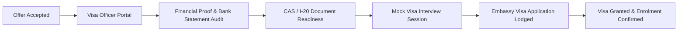
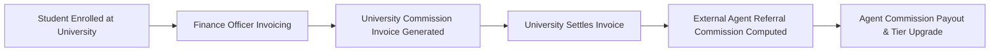

# EduCRM — Enterprise Multi-Tenant Global Higher Education Admissions & CRM Platform

[](https://education-crm-9fee2.web.app)
[](https://vitejs.dev/)
[](https://react.dev/)
[](https://www.typescriptlang.org/)
[](https://firebase.google.com/)
[](https://deepmind.google/technologies/gemini/)
[](https://vitest.dev/)

---

## 📌 Overview

**EduCRM** is an enterprise-grade, cloud-native higher education admissions management and CRM platform. Built for global university recruitment agencies, educational consultancies, and multi-campus institutions, EduCRM orchestrates the entire international student journey—from first contact and AI-assisted CV evaluation, to university partner admissions, visa clearance, commission distribution, and compliance auditing.

---

## 🔑 Pre-Configured Demo Credentials & Access Matrix

You can sign in using the **One-Click Demo Launcher** (floating button on the bottom-right of `/login`) or by entering the pre-configured credentials below:

### 🌟 Live Admin Accounts (Persistent Firebase Auth)
| Role | Email Address | Password | Landing Page | Access Capabilities |
| :--- | :--- | :--- | :--- | :--- |
| **Platform Super Admin** | `live_superadmin@educrm.com` | `superadmin123` | `/` (Dashboard) | Global tenant management, security logs, branch provisioning, full system control |
| **Organization Admin** | `live_orgadmin@educrm.com` | `orgadmin123` | `/` (Dashboard) | Staff creation, regional office management, commission tiers, lead triage |

### 👥 Role-Based Demo Accounts (Instant 1-Click Access)
| Role Identifier | Role Name | Demo Email | Standard Password | Default Route |
| :--- | :--- | :--- | :--- | :--- |
| `student` | **Registered Student (Aarav Patel)** | `aarav.patel@gmail.com` | `EduCrmDemo2026!` *(or any)* | `/student/dashboard` |
| `student` | **New Student (Fresh Onboarding)** | `student@educrm.demo` | `EduCrmDemo2026!` | `/student/onboarding/step-1` |
| `counsellor` | **Education Counsellor** | `counsellor@educrm.demo` | `EduCrmDemo2026!` | `/counsellor/leads` |
| `team_leader` | **Admissions Team Leader** | `team_leader@educrm.demo` | `EduCrmDemo2026!` | `/team-leader` |
| `admissions_officer` | **Admissions Officer** | `admissions_officer@educrm.demo` | `EduCrmDemo2026!` | `/admissions` |
| `finance_officer` | **Finance & Accounts Officer** | `finance_officer@educrm.demo` | `EduCrmDemo2026!` | `/finance` |
| `visa_officer` | **Visa & Immigration Officer** | `visa_officer@educrm.demo` | `EduCrmDemo2026!` | `/visa` |
| `compliance_officer` | **Compliance & Auditor** | `auditor@educrm.demo` | `EduCrmDemo2026!` | `/compliance` |
| `support_user` | **Support Specialist** | `support_user@educrm.demo` | `EduCrmDemo2026!` | `/support` |
| `external_agent` | **External Recruitment Agent** | `external_agent@educrm.demo` | `EduCrmDemo2026!` | `/agent/dashboard` |
| `university_partner`| **University Partner Rep** | `university_partner@educrm.demo` | `EduCrmDemo2026!` | `/partner/dashboard` |

> 💡 **Demo Tip:** You can also register a brand new student account at `/register` and test the instant AI CV auto-fill scanner in real-time.

---

## 🔄 End-to-End System Flows

### Flow 1: Student Registration & AI CV Ingestion Flow



1. **CV Upload**: Student drops their résumé on `/register` or `/student/onboarding/step-1`.
2. **AI Extraction**: Multi-modal Gemini 3.8 Flash extracts personal identity, contact data, academic qualifications, and language test scores.
3. **Form Auto-Fill**: All inputs are populated with zero manual typing required.
4. **Account Creation**: Firebase Auth and Firestore records are created with sanitized, non-null payloads.
5. **Onboarding Guard**: Guides the student through the remaining onboarding stages if necessary.

---

### Flow 2: Programme Selection & 6-Step Application Wizard



1. **Step 1 — Programme & Eligibility**: Displays specific program requirements (e.g. Min IELTS 6.5, tuition fees, application deadlines).
2. **Step 2 — Document Upload & AI Scanner**: Ingests transcripts and resumes with instant data extraction.
3. **Step 3 — Personal Info Verification**: Auto-populated from the student profile with edit capabilities.
4. **Step 4 — English Language Proficiency**: Interactive selector (IELTS, PTE, TOEFL, Duolingo, MOI) with real-time pass/fail eligibility badges comparing the student score to programme thresholds.
5. **Step 5 — Statements & Visa History**: Statement of Purpose guidance, study gaps, and previous visa refusal declarations.
6. **Step 6 — Review & Two-Way Sync**: Submits the application and simultaneously updates `students/{uid}` and `users/{uid}` in Firestore.

---

### Flow 3: Admissions Triage, Partner Review & Offer Issuance



1. **Admissions Triage (`/admissions`)**: Admissions Officers review submitted applications, verify attached transcripts and English scores, and check regional eligibility.
2. **University Partner Portal (`/partner/dashboard`)**: Partner universities review candidate dossiers, update applicant status, and issue official conditional/unconditional offer letters.
3. **Student Notification**: The student's dashboard reflects real-time status transitions (`submitted` → `under_review` → `conditional_offer` → `unconditional_offer`).

---

### Flow 4: Visa Processing & CAS/I-20 Clearance Flow



1. **Visa Officer Assessment (`/visa`)**: Specialist visa officers verify proof of funds, source of income, tuberculosis tests, and academic progression.
2. **CAS / I-20 Management**: Verifies Confirmation of Acceptance for Studies (CAS) or I-20 certificates.
3. **Visa Interview Preparation**: Counselors schedule mock interview sessions and record readiness notes.

---

### Flow 5: Finance Invoicing & Agent Commission Settlement Flow



1. **Invoicing (`/finance`)**: Generates automated commission invoices to universities upon student enrolment.
2. **Agent Commissions (`/agent/dashboard`)**: External recruitment partners receive automated commission calculations based on their active commission tier (Standard, Silver, Gold, Platinum).

---

## 🚀 Key Platform Capabilities

### 1. 🤖 Gemini 3.8 Flash AI Student & CV Engine
- **Multimodal Document Parsing**: Ingests student CVs, résumés, and academic transcripts in PDF, Word (`.docx`), text (`.txt`), or raw pasted text.
- **Client-Side Fallback Engine**: Uses a combination of Google Gemini 3.8 Flash and a 1,000+ line local heuristic regex parser for 100% reliable offline extraction.
- **Automated Field Population**: Instantly populates:
  - First Name, Last Name, Full Name
  - Cleaned Email & International Phone
  - Country of Residence & Nationality Demonyms
  - Date of Birth, Gender, City
  - Complete Academic Qualification Records (Institution, Degree, GPA/Grade, Completion Year)
  - English Language Proficiency Tests (IELTS, PTE, TOEFL, Duolingo, MOI) with Scores and Expiry Dates
- **Zero-Manual Data Entry**: Available on Registration, Onboarding Stage 1, and Application Wizard.

### 2. 🔐 Fine-Grained Role-Based Access Control (RBAC)
The platform supports **10+ distinct user roles** with strict tenant and boundary isolation:

| Role Identifier | Role Label | Description & Access Scope |
| :--- | :--- | :--- |
| `platform_super_admin` | Platform Super Admin | Full system access across all tenants, offices, roles, audit logs, and global configuration. |
| `org_admin` | Organization Admin | Manages branch offices, staff provisioning, commission tiers, and operational pipelines. |
| `counsellor` | Education Counsellor | Manages assigned student leads, schedules sessions, and assists in university applications. |
| `office_manager` | Regional Office Manager | Oversees regional hub performance, counsellor workload, and local lead assignments. |
| `team_leader` | Admissions Team Leader | Reassigns applications, monitors admissions triage, and balances counsellor bandwidth. |
| `admissions_officer` | Admissions Officer | Reviews submitted applications, validates academic credentials, and communicates with universities. |
| `finance_officer` | Finance & Accounts Officer | Manages university commission invoices, student fees, agency payouts, and commission tiers. |
| `compliance_officer` | Compliance & Audit Officer | Audits GDPR data processing consents, document authenticity, and security compliance. |
| `visa_officer` | Visa & Immigration Officer | Evaluates financial proofs, CAS/I-20 readiness, visa compliance, and mocks interviews. |
| `external_agent` | External Recruitment Partner | Submits student referrals, tracks application statuses, and monitors commission earnings. |
| `university_partner` | University Admissions Rep | Reviews candidate portfolios, issues conditional/unconditional offers, and manages program seats. |
| `student` | Prospective International Student | Builds master profile, auto-applies with AI CV scanner, uploads documents, and tracks admissions. |

---

## 🛠️ Technology Stack

| Layer | Technology | Description |
| :--- | :--- | :--- |
| **Frontend Framework** | React 19 + TypeScript | High-performance, strictly typed component architecture |
| **Build Tool** | Vite 6.0 | Sub-second HMR, optimized multi-vendor chunking |
| **Styling & Design** | Tailwind CSS + Lucide React | Glassmorphism, tailored dark/light theme, modern typography |
| **Database & Realtime** | Firebase Cloud Firestore | NoSQL realtime synchronization, security rules, indexes |
| **Authentication** | Firebase Authentication | Email/Password, Email Verification, Session Persistence |
| **AI Evaluation** | Google Gemini 3.8 Flash | Large Language Model for deep document & CV information parsing |
| **Client Document Processing** | PDF.js + Mammoth | In-browser PDF & DOCX text extraction without server latency |
| **Testing** | Vitest + React Testing Library | 27 automated test suites with 188 unit & integration tests |
| **Hosting & CI/CD** | Firebase Hosting + GitHub | Global CDN edge caching with automated deployment pipelines |

---

## 📂 Project Structure

```
CRM/
├── .github/                      # CI/CD Workflows
├── src/
│   ├── components/               # Reusable UI & Business Components
│   │   ├── ai/                   # AI CV Uploader & Document Scanners
│   │   ├── applications/         # Application Cards & Stage Trackers
│   │   ├── layout/               # Navbars, Sidebar, ProtectedLayout & OnboardingGuards
│   │   ├── student/              # Student Profile, Documents & Readiness Badges
│   │   └── ui/                   # Buttons, Modals, Forms & Stat Cards
│   ├── contexts/                 # React Contexts (AuthContext, ThemeContext)
│   ├── data/                     # Demo Data, University Catalogs & Programme Specs
│   ├── firebase/                 # Firebase SDK initialization & Config
│   ├── pages/                    # Core Route Pages
│   │   ├── admin/                # Super Admin, Tenant Config, User Management
│   │   ├── portal/               # Student, Agent & Partner Portals
│   │   │   ├── onboarding/       # 4-Stage Student Onboarding Pages
│   │   │   ├── StudentApplicationWizard.tsx
│   │   │   ├── StudentDashboard.tsx
│   │   │   ├── StudentDocumentVault.tsx
│   │   │   └── StudentNewApplication.tsx
│   │   ├── public/               # Public Programme Search & Wizard
│   │   ├── Login.tsx             # Universal Sign-In with Demo Fast-Login
│   │   ├── Register.tsx          # Multi-Role Registration with AI CV Auto-Fill
│   │   └── VerifyEmail.tsx       # Email Verification & Instant Demo Pass
│   ├── types/                    # TypeScript Data Models (Student, Application, Role, etc.)
│   └── utils/                    # Business Logic, AI Parsers, Readiness & Security Helpers
│       ├── cvExtractor.ts        # Gemini AI & Heuristic CV Engine
│       ├── geminiClient.ts       # Gemini API client
│       ├── profileCompleteness.ts# Profile scoring calculation
│       └── roleBackgrounds.ts    # Ambient atmospheric backgrounds
├── tests/                        # Vitest Unit & Integration Test Suites
│   ├── security/                 # RBAC, Firestore security & privilege tests
│   └── unit/                     # Registration, Onboarding & Wizard tests
├── firebase.json                 # Firebase Hosting & Firestore configuration
├── firestore.rules               # Production Firestore Security Rules
├── package.json                  # Dependencies & Scripts
└── vite.config.ts                # Vite build & chunking configuration
```

---

## ⚙️ Installation & Local Development

### Prerequisites
- **Node.js**: v18.0.0 or higher
- **npm** or **yarn**
- **Git**

### 1. Clone the Repository
```bash
git clone https://github.com/MujtabaZaheer/CRM.git
cd CRM
```

### 2. Install Dependencies
```bash
npm install
```

### 3. Environment Configuration
Create a `.env` file in the project root:

```env
# Firebase Configuration
VITE_FIREBASE_API_KEY=your_firebase_api_key
VITE_FIREBASE_AUTH_DOMAIN=education-crm-9fee2.firebaseapp.com
VITE_FIREBASE_PROJECT_ID=education-crm-9fee2
VITE_FIREBASE_MESSAGING_SENDER_ID=324490740107
VITE_FIREBASE_APP_ID=1:324490740107:web:bad87398d3b03e8c0a6f8e

# Gemini AI Configuration (Optional for deep AI; local heuristic fallback is built-in)
VITE_GEMINI_API_KEY=your_gemini_api_key

# Mode Settings
VITE_DEMO_MODE=false
VITE_REQUIRE_VERIFIED_EMAIL=true
```

### 4. Run Development Server
```bash
npm run dev
```
The application will start on `http://localhost:5173`.

---

## 🧪 Testing Suite

EduCRM contains a comprehensive automated test suite covering security rules, role boundaries, registration auto-fill, CV extraction, and application state transitions.

```bash
# Run all tests once
npm test -- --run

# Run in watch mode for development
npm test
```

### Test Coverage Highlights:
- ✅ **CV Extraction & AI Engine**: PDF parsing, multi-degree detection, name cleaning, and demonym normalization.
- ✅ **Registration Auto-Fill**: Verifies `Register.tsx` and `StudentOnboardingStage1.tsx` CV data binding.
- ✅ **RBAC & Security**: Privilege escalation prevention, role impersonation guards, and chat permission rules.
- ✅ **Tenant & Branch Scoping**: Lead assignment, city routing, and regional desk isolation.

---

## 🚢 Production Build & Deployment

### Build Bundle
```bash
npm run build
```
Creates an optimized, minified production build in the `dist/` directory with code-split vendor chunks.

### Deploy to Firebase Hosting
```bash
npx firebase deploy --only hosting
```

---

## 🔒 Security & Data Compliance

1. **Firestore Security Rules**: Strict schema validation preventing unauthorized role elevation or cross-tenant data access.
2. **GDPR Consent Logging**: Every student registration and profile update records an immutable timestamped consent record in `consent_records`.
3. **Document Privacy**: Student passports, financial statements, and academic transcripts are isolated with role-restricted viewing permissions.

---

## 📄 License

This software is proprietary and confidential. Developed for EduCRM Global International Education Placements. All rights reserved.
