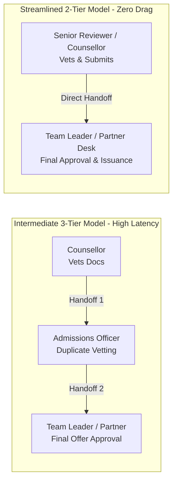

# CRM Security & Governance: RBAC Audit & Role Deprecation Specification

**Document Version:** 1.0.0  
**Status:** Approved for Implementation  
**Audience:** Systems Engineers, Technical Architects, Security Operations, CRM Product Leadership  

---

## 1. Executive Summary & Strategic Context

As our Education CRM scales from single-office deployments to an institutional multi-tenant network spanning multiple cities (London, Manchester, Lahore, Delhi, Dubai) and partner universities, the security boundary architecture and Role-Based Access Control (RBAC) hierarchy must balance two fundamental priorities:
1. **Zero Cross-Tenant Data Leakage**: Absolute partitioning between geographical and institutional tenants.
2. **Lean, Unblocked Operational Routing**: Eliminating redundant administrative tiers that introduce ticket latency, ambiguous ownership, and operational drag.

This specification details the architectural findings of our RBAC audit, focuses on the operational touchpoints of the intermediate **"Admissions Officer"** tier, and establishes a zero-downtime deprecation and user re-assignment roadmap.

---

## 2. Gap Analysis: Intermediate "Admissions Officer" Tier

### 2.1 Current Operational Touchpoints Audit
A comprehensive audit of the CRM codebase identified that the `admissions_officer` role interacts with the following system touchpoints:
* **Routes & UI Workspaces**: Dedicated `/admissions/*` portal (`AdmissionsWorkspace.tsx`), containing sub-views for dashboard, applications, document verification, offers, and tasks.
* **Access Gates**: `RoleGate` whitelisting across `/applications`, `/tasks`, `/students`, `/leads`, `/documents`, and `/dashboard`.
* **Chat Boundaries**: Allowed to initiate conversations with students and support users (`chatPermissions.ts`).
* **Lifecycle Actions**: Advancing application stages (`Initial Review` through `Conditional Offer`), verifying uploaded transcripts, and recording admissions notes.

### 2.2 Operational Drag & Permission Redundancy Analysis



Our operational analysis revealed critical friction points:
1. **Redundant Document Verification**:
   * Front-line Counsellors already perform document validation (transcripts, IELTS/TOEFL score verification, passport authenticity) during onboarding.
   * Admissions Officers perform a second pass of the exact same checklist without additional verification tooling, introducing an average queue delay of 36 to 72 hours per application dossier.
2. **Lack of Decision Sovereignty**:
   * Admissions Officers cannot unilaterally issue unconditional offers or binding CAS/COE documents without sign-off from senior decision-makers (`team_leader`, `office_manager`) or academic institutional representatives (`university_partner`).
   * As a result, the role functions as an intermediate transit station rather than an authoritative decision gate.
3. **Queue Hopping & Disjointed Accountability**:
   * When student applications require clarifications or document re-uploads, Admissions Officers route tasks back to counsellors, resulting in multi-hop email ping-pong and confusion over primary applicant ownership.

---

## 3. Comprehensive RBAC / ABAC Capability Matrix

The following matrix contrasts operational capabilities across adjacent roles:

| Operational Capability | Counsellor (Junior Reviewer) | Admissions Officer (Intermediate) | Team Leader (Senior Decision Maker) | Office Manager (Local Admin) | University Partner (Academic Partner) |
| :--- | :---: | :---: | :---: | :---: | :---: |
| **Lead Capture & Initial Triage** | ✅ Full | ❌ Restricted | ✅ Full | ✅ Full | ❌ Restricted |
| **Dossier Preparation & Document Upload** | ✅ Full | ✅ Read-only | ✅ Full | ✅ Full | ❌ Restricted |
| **Document Verification & QA** | ⚠️ Initial Check | ✅ Full Check | ✅ Override Approval | ✅ Override Approval | ✅ Partner Verification |
| **Application Stage Transition** | ⚠️ Stages 1-5 | ⚠️ Stages 1-10 | ✅ All 20 Stages | ✅ All 20 Stages | ✅ Decision Stages (7-12) |
| **Application Reassignment** | ❌ None | ⚠️ Intra-team only | ✅ Full (All Staff) | ✅ Full + Cross-Tenant | ❌ None |
| **Application Dossier Lock/Unlock** | ❌ None | ❌ None | ✅ Authorized | ✅ Authorized | ❌ None |
| **Offer Issuance & Decision Sign-off** | ❌ None | ⚠️ Draft Offer only | ✅ Full Authority | ✅ Full Authority | ✅ Direct University Decision |
| **Cross-Tenant Boundary Escalation** | ❌ None | ❌ None | ❌ Blocked | ✅ Branch Authorized | ❌ None |
| **Audit Log Inspection** | ⚠️ Own Cases | ⚠️ Assigned Cases | ✅ Team Queue | ✅ Full Branch | ⚠️ University Cases |

---

## 4. Architectural Recommendation: Formal Deprecation

> **RECOMMENDATION: DEPRECATE THE STANDALONE "ADMISSIONS OFFICER" ROLE**  
> We recommend consolidating operational permissions into an optimized **two-tier architecture**:
> 1. **Operations & Review Tier (`counsellor`)**: Senior Counsellors assume pre-submission vetting and triage responsibilities.
> 2. **Decision & Partner Tier (`team_leader` / `university_partner`)**: Team Leaders and Partner Officers retain sole authority for conditional/unconditional offers, CAS issuance, and application reassignment.

---

## 5. Phased Deprecation & Migration Roadmap

To guarantee zero workflow interruption for active staff members and zero downtime for applicants, role rationalization follows a four-phase transition:

```mermaid
timeline
    title Role Deprecation & Transition Timeline
    section Phase 1: Dual-Compatibility
        Q3 2026 : Fallback Permission Merging
                : UI Deprecation Notice
                : Boundary Hardening
    section Phase 2: Active User Re-assignment
        Q4 2026 : Track Selection (Reviewer vs. Decision)
                : Account Role Updates
                : Zero-Downtime Data Migration
    section Phase 3: Route Consolidation
        Q1 2027 : Seamless 301 Redirects to /applications
                : Workspace Tab Merging
    section Phase 4: Schema Cleanup
        Q2 2027 : Role Enum Decommission
                : Firestore Security Rule Pruning
```

### Phase 1: Dual-Compatibility & Announcement (Current Phase)
* **Status**: Implemented in codebase.
* **Mechanism**: Active accounts with `role: "admissions_officer"` receive `isDeprecatedRole: true` and `roleEffectiveFallback: "team_leader"`.
* **Zero Permission Gap**: The `getEffectivePermissions()` engine dynamically merges base capabilities with fallback capabilities, ensuring no existing officer experiences privilege loss.
* **Security Boundaries**: Firestore RLS rules permit legacy read/update operations while preventing creation of new `admissions_officer` credentials.

### Phase 2: User Re-Assignment Strategy
Active officers are mapped into one of two specialized standard tracks based on institutional responsibility:
* **Track A: Senior Admissions Counsellor (`counsellor`)**:
  * Focus: Applicant document collation, intake review, and pre-submission compliance.
  * Role mapping: `role = "counsellor"`, `assignedDepartment = "Admissions Operations"`.
* **Track B: Academic Decision Lead (`team_leader`)**:
  * Focus: Offer approval, caseworker capacity allocation, lock overrides, and cross-departmental handoffs.
  * Role mapping: `role = "team_leader"`, `assignedDepartment = "Admissions & Decisions"`.

### Phase 3: Route Consolidation & UI Harmonization
* The dedicated `/admissions/*` routes will transition to transparent redirects to the centralized `/applications` Dossier & Tracker.
* The centralized Applications Tracker now integrates document checklists, single/bulk reassignment, and status updates directly in one unified interface.

### Phase 4: Decommission & Cleanup
* Remove `"admissions_officer"` from `UserRole` union type in `src/types/role.ts`.
* Archive historical audit logs referencing the legacy role string.

---

## 6. Multi-Tenant Data Isolation Guarantee

To eliminate cross-tenant leakage between partner institutions and branch cities:
1. **Row-Level Security (Database Layer)**:
   * Firestore rules enforce `resource.data.tenantId == profile().tenantId` on all application, student, and lead reads and mutations.
   * Cross-tenant tampering is strictly denied: `!request.resource.data.diff(resource.data).affectedKeys().hasAny(['tenantId'])`.
2. **Middleware & Client Filtering (Application Layer)**:
   * The `filterRecordsByTenant()` engine intercepts all cached state, dashboard summaries, and report aggregators, ensuring non-super-admins have zero memory or DOM representation of foreign tenant records.
3. **Escalation Audit Trail**:
   * All inter-institutional handoffs require executive clearance (`platform_super_admin`, `org_admin`, or `office_manager`) and create immutable audit records in `audit_logs`.
