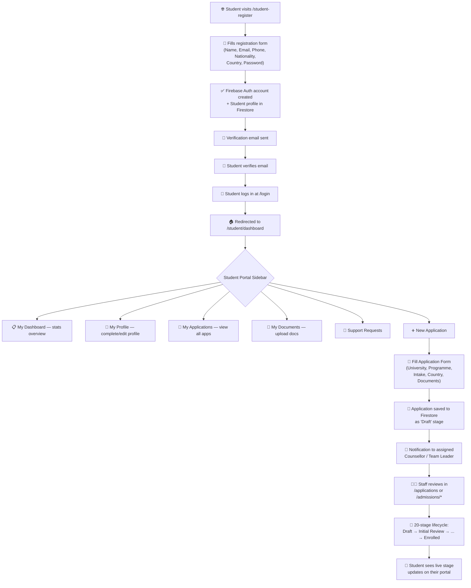

# Student Self-Service Application Submission & Registration Flow

Enable students to register, log in, and directly submit new university applications from their student portal — with applications flowing through the full 20-stage lifecycle visible to Counsellors, Admissions Officers, Team Leaders, and all other staff roles.

---

## Complete Student Flow (End-to-End)

Here is the full journey a **new student** would follow to submit an application:



### Detailed Steps:

1. **Register** → Student visits `/student-register`, fills in name, email, phone, nationality, country, password
2. **Email Verification** → Firebase sends verification email; student must verify before login
3. **Login** → Student logs in at `/login` with email/password
4. **Auto-Redirect** → AuthContext detects `role: "student"` and redirects to `/student/dashboard`
5. **Complete Profile** → Student navigates to "My Profile" to add academic history, English test scores, etc.
6. **Submit Application** → Student clicks "New Application" button → fills in university, programme, intake, uploads documents
7. **Application Created** → Application saved to Firestore `applications` collection with `stage: "Draft"`, `studentId` = student's UID
8. **Staff Processing** → Counsellors see the application in their Applications queue. Team Leaders can assign it. Admissions Officers process it through the 20-stage pipeline.
9. **Live Tracking** → Student sees real-time stage updates on their "My Applications" page via Firestore `onSnapshot`.

---

## User Review Required

> [!IMPORTANT]
> The student-submitted applications will start at **"Draft"** stage by default. Staff (counsellors, admissions) can then review and advance them through the pipeline. Is this correct, or should student submissions start at "Initial Review" instead?

> [!IMPORTANT]
> Currently students can only upload replacement documents. The new flow adds a **full application creation form** to the student portal. The form will ask for: University Name, Programme Name, Intake, Target Country, and optional document uploads. Should we also include a "Personal Statement / SOP" text field?

---

## Proposed Changes

### Student Portal — New Application Submission

#### [NEW] [StudentNewApplication.tsx](file:///c:/Users/mujta/OneDrive/Documents/Projects/CRM/src/pages/portal/StudentNewApplication.tsx)

A new dedicated page where authenticated students can submit a new university application. The form will include:
- University Name (text input or searchable dropdown from the `universities` collection)
- Programme Name
- Intake (dropdown: Fall 2026, Spring 2027, etc.)
- Target Country
- Optional document upload (transcript, English test, passport)
- Personal statement text area
- Submit button → creates `Application` in Firestore with `stage: "Draft"`, `studentId` = current user's UID

The page will reuse the existing `usePortalData` hook's data + extend it with an `addApplication` function.

---

### Student Portal Routing & Navigation

#### [MODIFY] [App.tsx](file:///c:/Users/mujta/OneDrive/Documents/Projects/CRM/src/App.tsx)

Add new route under the `/student` route group:
```diff
 <Route path="/student" element={<RoleRoute role="student" />}>
   <Route path="dashboard" element={<RolePortal role="student" page="dashboard" />} />
   <Route path="profile" element={<RolePortal role="student" page="profile" />} />
   <Route path="applications" element={<RolePortal role="student" page="applications" />} />
   <Route path="documents" element={<RolePortal role="student" page="documents" />} />
   <Route path="requests" element={<RolePortal role="student" page="requests" />} />
   <Route path="tasks" element={<RolePortal role="student" page="tasks" />} />
+  <Route path="new-application" element={<StudentNewApplication />} />
 </Route>
```

#### [MODIFY] [Sidebar.tsx](file:///c:/Users/mujta/OneDrive/Documents/Projects/CRM/src/components/layout/Sidebar.tsx)

Add "New Application" nav item to the `studentNavItems` array:
```diff
 const studentNavItems: NavItem[] = [
   { label: "My Dashboard", path: "/student/dashboard", icon: <LayoutDashboard /> },
   { label: "My Profile", path: "/student/profile", icon: <UserCheck /> },
   { label: "My Applications", path: "/student/applications", icon: <FileText /> },
+  { label: "New Application", path: "/student/new-application", icon: <Plus /> },
   { label: "My Documents", path: "/student/documents", icon: <FolderOpen /> },
   { label: "My Tasks", path: "/student/tasks", icon: <CheckSquare /> },
   { label: "Support Requests", path: "/student/requests", icon: <MessageSquare /> },
 ];
```

---

### RolePortal Enhancement — "New Application" Button on Applications Page

#### [MODIFY] [RolePortal.tsx](file:///c:/Users/mujta/OneDrive/Documents/Projects/CRM/src/components/portal/RolePortal.tsx)

Add a prominent "New Application" button on the student `applications` page that links to `/student/new-application`. Also add a "New Application" quick-action card on the student dashboard.

---

### Portal Data Hook — Add Application Creation

#### [MODIFY] [usePortalData.ts](file:///c:/Users/mujta/OneDrive/Documents/Projects/CRM/src/hooks/usePortalData.ts)

Add a `createApplication` function to the hook that writes to the Firestore `applications` collection:
```typescript
const createApplication = useCallback(async (data: {
  universityName: string;
  programmeName: string;
  intake: string;
  targetCountry: string;
}) => {
  if (!ownStudent) throw new Error("Student profile not found");
  const appNumber = `APP-${new Date().getFullYear()}-${Math.floor(1000 + Math.random() * 9000)}`;
  await addDoc(collection(db, "applications"), {
    applicationNumber: appNumber,
    studentId: ownStudent.id,
    studentName: ownStudent.fullName,
    studentEmail: ownStudent.email,
    universityId: "univ-self",
    universityName: data.universityName,
    programmeId: "prog-self",
    programmeName: data.programmeName,
    intake: data.intake,
    targetCountry: data.targetCountry,
    stage: "Draft",
    history: [{ stage: "Draft", updatedBy: ownStudent.email, timestamp: Date.now(), note: "Application submitted by student." }],
    createdAt: Date.now(),
    updatedAt: Date.now(),
  });
}, [ownStudent]);
```

---

### Login Page — Student Register Link

#### [MODIFY] [Login.tsx](file:///c:/Users/mujta/OneDrive/Documents/Projects/CRM/src/pages/Login.tsx)

Ensure the login page has a visible "Register as Student" link/button that navigates to `/student-register`. (The existing page already has role-based demo login but we'll add a prominent student registration CTA.)

---

### Auth Flow — Auto-redirect Students After Login

#### [MODIFY] [ProtectedLayout.tsx](file:///c:/Users/mujta/OneDrive/Documents/Projects/CRM/src/components/layout/ProtectedLayout.tsx)

No changes needed here — the existing `ProtectedLayout` + `Sidebar` already shows `studentNavItems` when `role === "student"`, and the login page already redirects students to `/student/dashboard`.

---

### Obsidian Vault Updates

#### [MODIFY] [Student Self-Service Portal.md](file:///c:/Users/mujta/OneDrive/Documents/Projects/CRM/obsidian_vault/Student%20Self-Service%20Portal.md)

Update to reflect the new application submission capability:
- Add "New Application Submission" to features list
- Update status to reflect new self-service capabilities
- Document the complete student flow

#### [MODIFY] [Student Applicant Role.md](file:///c:/Users/mujta/OneDrive/Documents/Projects/CRM/obsidian_vault/Student%20Applicant%20Role.md)

Update to include:
- "Direct Application Submission" in responsibilities
- Change status from 🔴 Remaining Roadmap to 🟢 Implemented

#### [MODIFY] [Application Entity.md](file:///c:/Users/mujta/OneDrive/Documents/Projects/CRM/obsidian_vault/Application%20Entity.md)

Add note about student-originated applications and how they enter the pipeline at "Draft" stage.

#### [MODIFY] [Implementation Status Dashboard.md](file:///c:/Users/mujta/OneDrive/Documents/Projects/CRM/obsidian_vault/Implementation%20Status%20Dashboard.md)

Add Phase 8 entry documenting the student self-service application submission feature.

#### [MODIFY] [EduCRM System Overview.md](file:///c:/Users/mujta/OneDrive/Documents/Projects/CRM/obsidian_vault/EduCRM%20System%20Overview.md)

Update the Student Applicant role description to include direct application submission capability.

---

## Verification Plan

### Automated Tests
- `npm run build` — Ensure zero TypeScript/compilation errors after all changes

### Manual Verification
1. Open the app → navigate to `/student-register` → register a new student
2. Log in as student → verify redirect to `/student/dashboard`
3. Navigate to "New Application" → fill form → submit
4. Verify application appears in student's "My Applications" list
5. Log in as Counsellor/Admissions → verify the student's application shows in staff views
6. Verify application stage updates from staff side are reflected in student portal in real-time
7. Verify Obsidian vault files are updated and links are intact
