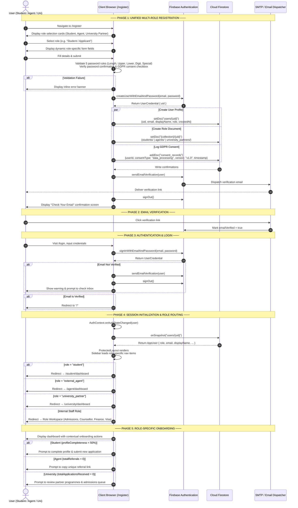
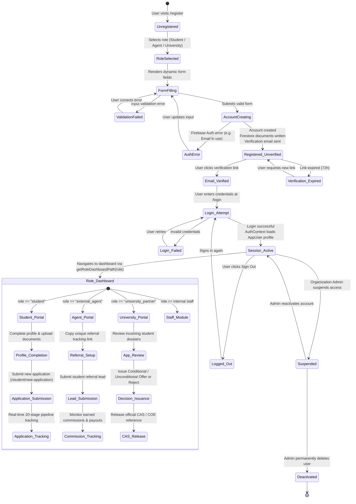

---
tags:
  - architecture/diagrams
  - diagrams/ssd
  - diagrams/state-transition
  - diagrams/bpmn
  - status/completed
date: 2026-09-03
---

# 📊 EduCRM System Process Diagrams (SSD, State Transition, BPMN)

This document contains the complete, high-definition process diagrams for the EduCRM multi-role onboarding and application processing architecture.

---

## 1. 🔄 System Sequence Diagram (SSD)

Shows the full interaction between actors and system components for the **registration → email verification → login → session init → onboarding** flow.

---

## 2. 🔀 State Transition Diagram

Documents the lifecycle states of a user account from initial registration through full activation, operational stages, and administrative status transitions.

---

## 3. 🗺️ BPMN Process Diagram

Comprehensive Business Process Model and Notation diagram organized with dedicated swimlanes for User, System, Email Verification, Login & Session, Role Routing, Onboarding, and Admin lanes.

```mermaid
flowchart TD
    subgraph UserLane["👤 USER (Student / Agent / University Partner)"]
        A["Visit /register"] --> B{"Select Role"}
        B -->|Student| C1["Fill Student Form<br/>(Name, Email, Phone,<br/>Nationality, Country)"]
        B -->|Agent| C2["Fill Agent Form<br/>(Name, Email, Phone,<br/>Agency Name, Country)"]
        B -->|University| C3["Fill University Form<br/>(Name, Email, University Name,<br/>Position, Country)"]
        C1 --> D["Set Password (5 Rules) +<br/>Accept GDPR Consent"]
        C2 --> D
        C3 --> D
        D --> E["Click 'Create Account'"]
    end

    subgraph SystemLane["⚙️ SYSTEM BACKEND (Firebase Auth & Firestore)"]
        E --> F{"Validate Form &<br/>Password Strength"}
        F -->|Fail| G["Display Form Error Message"]
        G --> D
        F -->|Pass| H["Create Firebase Auth Account<br/>(createUserWithEmailAndPassword)"]
        H --> I["Write users/{uid} Base Profile<br/>(role, email, displayName)"]
        I --> J{"Selected Role?"}
        J -->|Student| K1["Write students/{uid}<br/>(profileCompleteness: 30)"]
        J -->|Agent| K2["Write agents/{uid}<br/>(referralCode: REF-XXXX)"]
        J -->|University| K3["Write university_partners/{uid}<br/>(position, institution)"]
        K1 --> L["Write consent_records Document<br/>(consentType: data_processing)"]
        K2 --> L
        K3 --> L
        L --> M["Dispatch Verification Email<br/>(sendEmailVerification)"]
        M --> N["Sign Out Auth Session (signOut)"]
        N --> O["Display 'Check Your Email'<br/>Confirmation Screen"]
    end

    subgraph VerifyLane["📧 EMAIL VERIFICATION SERVICE"]
        O --> P["User Receives Verification Email"]
        P --> Q{"Click Verification Link?"}
        Q -->|Yes| R["Firebase Auth Updates<br/>emailVerified = true"]
        Q -->|No / Link Expired| S["User Requests New Link<br/>at /login"]
        S --> P
    end

    subgraph LoginLane["🔐 AUTHENTICATION & LOGIN"]
        R --> T["User Navigates to /login"]
        T --> U["Input Email & Password"]
        U --> V{"Firebase Auth<br/>Validation"}
        V -->|Invalid| W["Show Error Banner"]
        W --> U
        V -->|Valid| X{"emailVerified == true?"}
        X -->|No| Y["Resend Verification Link &<br/>Block Session"]
        Y --> P
        X -->|Yes| Z["AuthContext onAuthStateChanged<br/>Loads Profile from users/{uid}"]
    end

    subgraph RoutingLane["🧭 ROLE-BASED ROUTING"]
        Z --> AA{"Evaluate appUser.role"}
        AA -->|student| BB["Navigate to /student/dashboard"]
        AA -->|external_agent| CC["Navigate to /agent/dashboard"]
        AA -->|university_partner| DD["Navigate to /university/dashboard"]
        AA -->|staff roles| EE["Navigate to Role Workspace<br/>(Admissions / Counsellor / Finance / Visa)"]
    end

    subgraph OnboardingLane["🎯 ROLE-SPECIFIC WORKFLOW & ONBOARDING"]
        BB --> FF["Student Self-Service Portal:<br/>1. Complete Profile (/student/profile)<br/>2. Upload Documents (/student/documents)<br/>3. Submit Direct Application (/student/new-application)<br/>4. Track Real-Time 20-Stage Pipeline"]
        CC --> GG["External Agent Portal:<br/>1. Generate & Share Referral Link<br/>2. Register New Leads (/agent/refer-lead)<br/>3. Monitor Pipeline Progress (/agent/referrals)<br/>4. Track Commission Ledger (/agent/commissions)"]
        DD --> HH["University Partner Portal:<br/>1. Review Incoming Applications (/university/applications)<br/>2. 1-Click Offer / Reject Decisions<br/>3. Release CAS / COE Reference Numbers<br/>4. Monitor Processing Analytics"]
        EE --> II["Internal Staff Modules:<br/>Counsellor, Admissions Officer, Team Leader,<br/>Finance Officer, Visa Officer, Auditor"]
    end

    subgraph AdminLane["🛡️ ADMIN ONBOARDING (Invitation-Only Roles)"]
        JJ["Org Admin Generates Invitation at /users"] --> KK["Firestore Stores invitations/{token}"]
        KK --> LL["Email Sent with Link to /accept-invitation?token=xxx"]
        LL --> MM["Invited User Creates Verified Account"]
        MM --> NN["Accepts Invitation Token:<br/>users/{uid} Provisioned with Assigned Role"]
        NN --> Z
    end

    style UserLane fill:#064e3b,stroke:#34d399,color:#fff
    style SystemLane fill:#1e1b4b,stroke:#818cf8,color:#fff
    style VerifyLane fill:#451a03,stroke:#fbbf24,color:#fff
    style LoginLane fill:#172554,stroke:#60a5fa,color:#fff
    style RoutingLane fill:#0f172a,stroke:#38bdf8,color:#fff
    style OnboardingLane fill:#064e3b,stroke:#4ade80,color:#fff
    style AdminLane fill:#4c0519,stroke:#f472b6,color:#fff
```

---

## 🔗 Related Obsidian Documentation
- [[Student Application Lifecycle]] — Comprehensive 10-phase lifecycle flow
- [[Student Self-Service Portal]] — Student dashboard and application actions
- [[UML Sequence Diagrams & System Flow]] — Architectural sequence diagrams
- [[Core Architecture]] — Tech stack, context hierarchy, and security
- [[EduCRM System Overview]] — Executive role matrix and pipeline
