---
tags:
  - architecture/uml
  - diagrams/sequence
date: 2026-08-18
---

# 📐 EduCRM System Flow & UML Sequence Diagrams

See the complete artifact document: [system_architecture_and_sequence_diagrams.md](file:///home/mujtaba/.gemini/antigravity-ide/brain/4955320d-2c44-400a-a9a7-c4afdad1b728/system_architecture_and_sequence_diagrams.md)

---

## 🔄 End-to-End System Workflow

```
[1. Lead Capture] ➔ [2. Counselling & AI Match] ➔ [3. App Submission & Docs] ➔ [4. Admissions Review] ➔ [5. CAS & Visa] ➔ [6. Enrolment & Finance] ➔ [7. Audit & Quality]
```

## 1. System Sequence Diagram (SSD)

```mermaid
sequenceDiagram
    autonumber
    actor Lead as Student / Lead
    actor Agent as External Agent
    actor Counsellor as Education Counsellor
    actor Admissions as Admissions Officer
    actor Admin as Super Admin / Org Admin
    participant System as EduCRM Platform Boundary
    participant Drive as Google Drive Storage API
    participant Gemini as Google Gemini 2.0 AI API

    rect rgb(20, 30, 45)
    note right of Lead: Stage 1: Lead Ingestion & Registration
    Lead->>System: Submit Form / Register (Name, Email, Preferences)
    System-->>Lead: Send Confirmation & Provision Portal Access
    Agent->>System: Submit Referral Lead (Student Profile, Referral Code)
    System-->>Agent: Generate Referral Link & Commission Entry
    end

    rect rgb(25, 40, 35)
    note right of Counsellor: Stage 2: AI Counselling & Eligibility
    Counsellor->>System: Run AI Course Recommendation Query
    System->>Gemini: POST Prompt (GPA, IELTS, Budget, Preferences)
    Gemini-->>System: Return Ranked Universities & Rationale
    System-->>Counsellor: Display Ranked Course Matches & "Draft Application" button

    Counsellor->>System: Request AI Personal Statement (SOP)
    System->>Gemini: POST Prompt (Academic History, Career Goals)
    Gemini-->>System: Return Formatted SOP Text
    System-->>Counsellor: Display SOP Draft with Copy Action
    end

    rect rgb(35, 30, 50)
    note right of Lead: Stage 3: Document Storage & OCR
    Lead->>System: Upload Passport / Transcript File
    System->>Drive: POST Base64 File to Apps Script Endpoint
    Drive-->>System: Return Google Drive View/Download URL
    System->>Gemini: POST Document Image for Vision OCR
    Gemini-->>System: Return Extracted Name, DOB, Passport #, GPA
    System-->>Counsellor: Pre-populate Profile & Save Document Metadata
    end
```



## 2. Detailed Component Sequence Diagram (SD)

```mermaid
sequenceDiagram
    autonumber
    actor User as Counsellor / Student
    participant UI as React UI (Leads.tsx / Topbar.tsx)
    participant AuthCtx as AuthContext.tsx
    participant CounsellorHook as useCounsellorData.ts
    participant GeminiClient as geminiClient.ts
    participant DocStorage as documentStorage.ts
    participant Firestore as Cloud Firestore SDK
    participant DriveScript as Google Apps Script (Drive)
    participant GeminiAPI as Gemini 2.0 Flash REST API

    rect rgb(15, 25, 40)
    note over UI,Firestore: 1. Convert Lead to Student (Tenant-Scoped)
    User->>UI: Click "Convert Lead to Student"
    UI->>CounsellorHook: convertLeadToStudent(leadData)
    CounsellorHook->>AuthCtx: Get appUser (tenantId / office)
    CounsellorHook->>Firestore: addDoc("students", scopeDocumentWithTenant(newStudent, appUser))
    Firestore-->>CounsellorHook: Return studentDocId
    CounsellorHook->>Firestore: updateDoc("leads", leadId, { stage: "Converted" })
    CounsellorHook->>Firestore: addDoc("audit_logs", { action: "STUDENT_CONVERTED", ... })
    CounsellorHook-->>UI: Return studentDocId (Success)
    end
```


